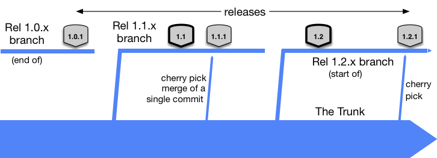

# Saleforce to Java

Reads platform events form saleforce using Java 17.


# Worflow status badges

[](https://github.com/MarcoLuglio/salesforce-java17-maven/actions/workflows/build-release-development.yml)
[](https://github.com/MarcoLuglio/salesforce-java17-maven/actions/workflows/build-release-acceptance.yml)
[](https://github.com/MarcoLuglio/salesforce-java17-maven/actions/workflows/build-release-production.yml)


# Requirements

* A [free Salesforce developer account](https://developer.salesforce.com/signup) and org
* [Java development toolkit (JDK) 17]()
* [Maven](https://maven.apache.org/)
* [Docker](https://www.azul.com/downloads/?version=java-17-lts&package=jdk)
* Kubernetes ([in docker](https://docs.docker.com/desktop/kubernetes/), [minikube](https://minikube.sigs.k8s.io/docs/start/), [minishift](https://docs.okd.io/3.11/minishift/getting-started/installing.html), [codeready containers](https://github.com/code-ready/crc)…) or a [free OpenShift developer account](https://developers.redhat.com/developer-sandbox)


# Maven config

Additional Maven parameters can be used in the GitHub pipeline by including them in the settings.xml file. Proxy authentication for instance can be put there.

```
<settings>
	<proxies>
		<proxy>
			<id>optional1</id>
			<active>true</active>
			<protocol>http</protocol>
			<host>TODO</host>
			<port>8080</port>
			<nonProxyHosts>localhost|*.mydomain.com</nonProxyHosts>
		</proxy>
	</proxies>
	<servers>
		<server>
			<id>central</id>
			<username>replacedByThePipelineUsername</username>
			<password>replacedByThePipelinePassword</password>
		</server>
	</servers>
</settings>
```


# How to debug

Environment variables are already pre-configured for VS Code.
Check the `.vscode/launch.json` file.


# Folder structure

* **src/main/java/marcoluglio/** Java source code for the application
* **.vscode/launch.json** Debugging configurations for VS Code
* **Dockerfile** Docker container definiton
* **kubernetes/** Kubernetes deployment definitions
* **.github/workflows/** GitHub pipeline definitions
* **settings.xml** Used by the GitHub pipeline to look for proxy configurations if needed
* **docs/** Images used by the README.md file


# Code versioning flow

Add dev and acc if needed from the diagrams below.

[Microsot using release flow](https://devblogs.microsoft.com/devops/release-flow-how-we-do-branching-on-the-vsts-team/)

[](https://devblogs.microsoft.com/devops/release-flow-how-we-do-branching-on-the-vsts-team/)

[releaseflow.org](http://releaseflow.org/)

[](http://releaseflow.org/)

[Trunk based development](https://trunkbaseddevelopment.com/branch-for-release/)

[](https://trunkbaseddevelopment.com/branch-for-release/)

[Atlassian](https://www.atlassian.com/git/tutorials/comparing-workflows/gitflow-workflow)

[](https://www.atlassian.com/git/tutorials/comparing-workflows/gitflow-workflow)


# Dashboard / Monitors

TODO Helm


# References

A